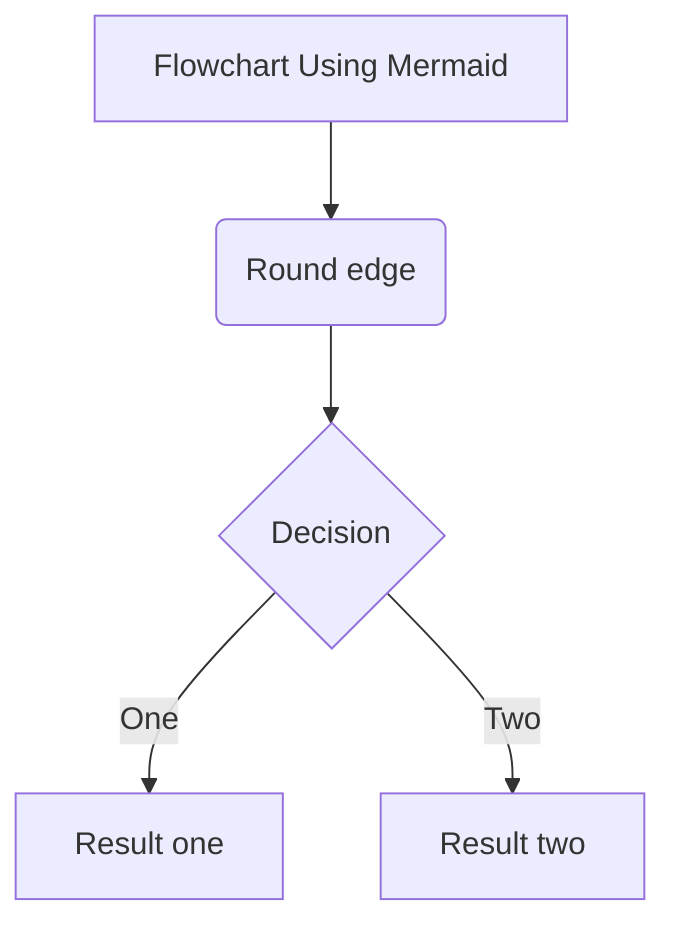

    

        <h1>电子科技大学</h1>
        <h1>上 机 实 验 报 告</h1>
    

    

    
学生姓名：张三 指导教师：李四

    
学号：2021XXXXXXXXX 上机时间：2021年12月02日

### 一、实验题目
- 

### 二、程序流程图

程序的流程图如下：

### 三、实验初始数据

- **商品价格数据**

| 产品号 | 零售价（元） |
| ------ | ------------ |
| 1      | 2.98         |
| 2      | 4.50         |
| 3      | 9.98         |
| 4      | 4.49         |
| 5      | 6.87         |

- **销售额数据**

| 产品号 | 1月销售 | 2月销售 | 3月销售 |
| ------ | ------- | ------- | ------- |
| 1      | 15      | 12      | 16      |
| 2      | 20      | 15      | 21      |
| 3      | 6       | 10      | 12      |
| 4      | 10      | 9       | 8       |
| 5      | 27      | 25      | 22      |

### 四、程序代码

~~~c
#include <stdio.h>

int main(void)
{
    printf("Hello World!");
    
    return 0;
}
~~~

### 五、运行结果(截图)
- 
- 
- 

### 六、课程心得 

